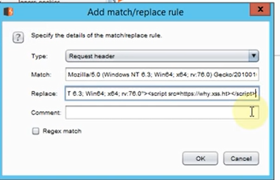

# Bug hunting methodology
## Checklist
- [ ]  Understand the application, and its business need
- [ ]  Check how many user roles exist, and create 2 accounts for each role
- [ ]  Cross-site scripting (XSS) - any user input being reflected in the page (i.e.	firstname, lastname, search text and so on)
- [ ]  Server-side	request forgery (SSRF) - Any parameter that has a URL or path as a	value (i.e.	https://www.site.com/page.aspx?Origin=google.com&url=https://www.google.com)
- [ ]  Insecure	Direct Object Reference (IDOR) - Check for any value that have a number or identifier, linked to user data or user activities
- [ ]  Server-side response manipulation - Check JSON responses, and manipulate any value that is being interpreted by the code (i.e. isadmin=false -- change it to isadmin=true and see if that would make you an admin)
- [ ]  For a misconfigured CORS to be a vulnerability, 3 things must be there.	**If any of these conditions fails, it is not a vulnerability.**
    - Following 2 response headers must present:
        - access-control-allow-origin: attackercontroledsite.com
        - access-control-allow-credentials: true
    - Response must be 200 OK, AND must contain sensitive data
    - There should not be any extra headers (i.e. Authorization)
- [ ]  Host header injection - in the password reset page, set the hostname to	your controlled hostname, and send a password reset to your account, then check your email if the password reset link includes your hostname.
- [ ]  XXE - any user input that contains XML data. Or any file upload page	that would accept .xml or .svg

## Methodology

  

  

  

  

  

### Domain Enumeration
- subfinder tool
    - subfinder -d  *.example.com
- virustotal.com
- amass tool
    - amass enum -d example.com
- Add the wildcards domains into a file called wildcards and use assetfinder and use anew tool to append unique values into a new file
    - cat wildcards | assetfinder —subs-only | anew domains
- Take the list of domains and check what is working using httprobe
    - cat domains | httprobe -c 80 —prefer-https | anew hosts
- findomain tool reading from txt domains and append new hosts to the file
    - findomain -f wildcards | tee -a findomain.out
    - copy the showed domains into new file from-findomain
- concate all the subdomains
    - cat from-findomain | anew domains | httprobe -c 50 | anew hosts

## Tools
### Information Gathering

- Sublist3r ⇒ Subdomain enumeration
- Sublert ⇒ for domain monitoring based on [crt.sh](http://crt.sh) to know if there is a new domain has registered, .. etc
- gitGraber ⇒ to search for sensitive info in Github repos like passwords, keys .. etc
- shodan.io
- [archive.org](http://archive.org) ⇒ Internet archive, take a copy of the website at periods … browsing history
- Browser plugins ⇒ Wapplayzer, and FlagFox
- LazyRecon ⇒ Collect of tools to recon

### Scanning

- Nmap with options like -A -auth -http-enum scripts
- S3Scanner ⇒ for insecure AWS buckets
- Subdomain Takover:
    - https://github.com/m4ll0k/takeover
    - https://github.com/haccer/subjack
- Run Burp Scanner in the background with the following plugins
    - J2EEScan, NGINX Alias Traversal, Telewreck, ParamMiner, Upload Scanner
    - Other plugins:
        

          
        

        
- Dirsearch ⇒ for backups and hidden files, and admin interfaces
- [xsshunter.com](http://xsshunter.com) ⇒ xss payloads notifier if executed(Apply it in UserAgent header or X-Forwarded-For in burp)

## Techniques

- Configure Burpsuite
    - Add target scope … target ⇒ scope tabs
    - Target Specified vuln for scanner … scanner ⇒ options ⇒ scan issues
    - Take a [xsshunter.com](http://xsshunter.com) payload and replace it in User-Agent header …. proxy ⇒ options ⇒ Match and replace ⇒ Add
         

          
        

    
    - Allow only intercept in the scope URL … Proxy ⇒ Options ⇒ Intercept Client Requests ⇒ mark on URL
- Subdomain Enumeration
    - Sublist3r
    - Archive.org ⇒ https://web.archive.org/cdx/search?url=*.corp.google.com&output=text&fl=original&collapse=urlkey
        - For the whole list. just browse to enable burp scan it
        - Search for parameters keywords like url, .sh, .zip, file, path, proxy … long URL have much parameters.
        - to save the body it ⇒ wget “URL” -O outputFile.txt
- Check for IP or UserAgent is printed somewhere and change it by header X-Forwarded-for, Client-IP, x-Client-IP… check Spoofable Client IP Address vuln in burp scanner
- Check the following script which take a list of URL resources to check if there is a redirect or the same (which can access it) ⇒ python [script.py](http://script.py) file.txt
    
    

      
    

    
    - If any of the founded URLs have robots.txt and response NotFound without redirection, then this means you can continue for this target… try brute force with **Dirsearch**
- Search for Framework/Technology Name vulnerabilities or exploits
- Privilege scalation
    - Copy the request of User/Admin (who can change/modify) and change the cookies with another user (who cannot change/modify) ⇒ try **authorize** plugin
